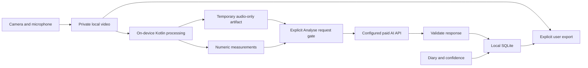

# Proposed final React Native / Expo architecture

Status: architecture documented; the user subsequently authorized the engineering foundation, including typed SQLite schema, initial migrations, database startup and developer checks. Product workflows and P0 evaluation remain unimplemented/unrun. Current setup evidence: [FOUNDATION_REPORT.md](FOUNDATION_REPORT.md). Product authority: [v1.6 specification](TAKE_TWO_SPEC_v1.6.md). Explicit resolutions and unresolved curriculum choices: [SPEC_REVIEW.md](SPEC_REVIEW.md). Let the official template and `npx expo install` choose SDK-compatible versions; preserve their generated lockfile rather than selecting package versions manually.

## Setup decisions from the subsequent user request

Use Zustand for transient/session state, Zod for runtime validation, `fast-xml-parser` for feeds, `@google/genai` for the future Gemini adapter, Drizzle ORM over Expo SQLite, and `drizzle-kit` as a development dependency. These choices supersede the earlier optional-library/HTTP-adapter proposals below. SQLite remains the durable source of truth; Zustand is not a second persistent database. SDK transport, Drizzle migrations and module APIs still require integration tests in their respective feature phases.

Install the requested standard Expo modules now through `npx expo install`, along with Router's required companion libraries. `expo-sharing` is available for the later explicit export flow; it does not itself implement ZIP creation. Defer VisionCamera, ML Kit wrappers, custom MediaExtractor/MediaMuxer modules and `expo-dev-client` until the native Studio/Coach phase. The user authorized environment/bootstrap work before P0 execution, while coach validation remains the gate for building the product engine.

## 1. Architecture decision

Build one Android application in TypeScript using Expo, Expo Router and SQLite. Keep business rules in pure feature-domain modules, device operations behind narrow service interfaces and personal state in app-private storage. Use a small local Kotlin Expo module for audio extraction, audio measurements, sampled head-pose measurements and streaming exports. Use direct, explicitly requested calls to a configured AI provider; there is no Take Two server, user account, cloud database or sync service.

Use `expo-camera` as the initial and intended production recorder, and `expo-video` for local playback. Measure the saved recording after capture, since the product requires no live measurement overlay. This avoids starting with two camera stacks. Treat post-record processing speed as a device gate. If it fails, a frame-processing camera implementation can replace the camera/measurement adapters in a new native build; it must not change the privacy contract or domain flow. This is a deliberate choice within §11's optional camera guidance, not an assumption that `expo-camera` supplies frame processors. [Expo Camera](https://docs.expo.dev/versions/latest/sdk/camera/), [Expo Video](https://docs.expo.dev/versions/latest/sdk/video/)

A custom development build is required before the first real AI-enabled day. Expo Go is suitable only for the navigation/mock-flow prototype and supported recording APIs; it cannot acquire our Kotlin module through JavaScript. [Development builds](https://docs.expo.dev/develop/development-builds/introduction/), [Expo Modules API](https://docs.expo.dev/modules/overview/)

## 2. Ownership and dependency direction

| Directory | Future responsibility |
|---|---|
| `src/app/` | Thin Expo Router routes/layouts: mount feature screens, map route parameters and configure navigation. No camera control, timers, SQL, provider requests or file operations. |
| `src/components/` | UI, cards, scores and recording presentation primitives; no feature workflow authority. |
| `src/features/` | Programme, prep/outline, studio, coach/compare, followup, writing, diary, vocabulary, progress and settings. Each owns domain rules, use cases and screens. |
| `src/db/` | Client, schema, seed entry points, repositories, transactions, query projections and recovery. |
| `src/services/` | Gemini, RSS, recording, audio, storage, notifications and export adapters; future measurement, credential and clock adapters follow the same boundary. |
| `src/store/`, `src/hooks/`, `src/constants/`, `src/types/`, `src/utils/` | Shared session state and reusable support code. Keep feature-specific logic with its feature instead of creating a second global business-logic layer. |
| `drizzle/` | Generated migrations from `src/db/schema.ts`, configured by root `drizzle.config.ts`; no runtime database files. |
| `assets/` | Bundled curriculum/source/topic data, local interruption sounds, typefaces and other nonpersonal assets. |
| `tests/` | Domain, repository, contract, device and end-to-end suites; synthetic fixtures committed later, never the user's personal recordings. |
| `docs/` | Immutable source specification, decisions, contracts, validation plans and results. |
| `modules/` (future) | Local Expo module `take-two-native`, Kotlin workers, Android media/ML/streaming-export interfaces and build configuration. |

Dependencies flow from routes/screens to feature use cases to repository/service interfaces. Concrete adapters are injected at app composition. Domain rules cannot import React Native, HTTP, SQLite handles or camera APIs. The diary repository has local persistence dependencies only; neither it nor its view model imports the AI gateway. Payload builders use explicit allowlists rather than serializing entire database entities.

React component state handles transient UI. SQLite is the sole durable source of truth. Use pure TypeScript transition functions for programme/workflow state; avoid adding a second persisted global store or a workflow framework unless later complexity warrants it. All mutable operations pass through use cases, so deep links cannot bypass progression rules.

The user's subsequent structure request places all application source under `src/` and maps `@/` to it. Root `app.config.ts` replaces `app.json`; assets remain outside source discovery. Current routes are one-line feature re-exports (apart from the navigation layout), with explicit placeholder screens until the respective phases are built. In particular, `src/app/day/[dayId]/studio.tsx` delegates to `src/features/studio/studio-screen.tsx`; recording/storage adapters will be implemented in their service directories. No database schema, seed behavior or feature workflow has been implemented by this reorganization.

## 3. Selected dependencies and build policy

| Concern | Proposed selection | Constraint / validation |
|---|---|---|
| Runtime | Stable Expo SDK with its supported React Native/React versions, TypeScript, Expo Router | Pin one compatible set and lockfile in P1a; record JDK, Gradle, Kotlin, Android SDK and device OS. Do not combine independently chosen “latest” packages. |
| Recording/playback | `expo-camera`, `expo-video`, `expo-keep-awake` during active capture | Front-camera capability check, 720p target and explicit fallback notice; 15-second through 10-minute captures on a physical device. |
| Persistence | `expo-sqlite`, prepared statements, typed repository interfaces | Foreign keys, migration versions and transactions. SQLCipher is not needed to claim app-private storage; do not claim the default DB is encrypted. [SQLite](https://docs.expo.dev/versions/latest/sdk/sqlite/) |
| Files | `expo-file-system` plus native streaming where needed | Copy/move recorder cache output into persistent private storage immediately; never retain programme takes only in purgeable cache. |
| Credentials | `expo-secure-store` | Keep API key out of SQLite, app bundle, debug output and exports. Android uses Keystore-backed encrypted values; uninstall and biometric changes require explicit handling. [SecureStore](https://docs.expo.dev/versions/latest/sdk/securestore/) |
| Native processing | Local Expo Kotlin module; Android media APIs; bundled ML Kit face detector | No cloud visual analysis, no model-download dependency on first offline use. Bundle/license/ABI compatibility verified in device build. |
| AI | One provider adapter, initially evaluate Gemini paid-project audio understanding | Configured HTTPS endpoint/model; direct audio input plus structured responses. Final model chosen by P0 evidence, not brand preference. No provider JS SDK required if its runtime assumptions conflict with React Native; a small HTTP adapter suffices. |
| Validation | Zod or equivalent single runtime-schema library | Pin in P1a; reject invalid/inconsistent data at the service boundary. |
| Input content | A maintained JS RSS/Atom parser behind `SourceRepository` | Pin after fixture checks; byte/time limits, no entity expansion, no arbitrary embedded scripts or automatic crawling. |
| Charts | `react-native-svg` with small in-house target-band/trend components | Chart semantics are simple; no extra native chart framework. Render gaps and accessible text alternatives. |
| Reminders | `expo-notifications` local scheduling only | Editable 18:00 local-time default, no push token/server. Permission denial must not block practice. |
| Diary lock | `expo-local-authentication` | Optional access gate with device-auth fallback when available; not a claim of row encryption. |
| Updates | `expo-updates` / EAS Update, runtime fingerprint | Separate development/preview/release channels. New native modules, permissions or bundled ML changes require a new compatible binary. |
| Testing | Jest/jest-expo, React Native Testing Library; Android instrumented tests for native workers; Maestro for device journeys | Select compatible versions when implementation starts. Test domain rules with injected clocks, files and AI responses. |

Use Expo continuous native generation/config plugins to keep manifest and module configuration reproducible. Generate `android/` only during the future build work; preserve native source in the local module. An EAS account, if used for building/updating, is a developer tool account, not an app login. Personal recordings and evaluation artifacts must be excluded from Git, build contexts and OTA assets.

## 4. Personal-data boundary

The AI gateway supports distinct request contracts:

| Request | Allowed content | Trigger |
|---|---|---|
| Take 1 critique | Verified audio-only artifact, topic/task policy, allowed numeric measurements; outline only if explicitly included | User taps Analyse for that take. |
| Take 2/3 delta | That take's verified audio, original correction IDs/text, necessary prior transcript evidence and comparable measurements | User requests comparison; no automatic background upload on record-stop. |
| Live-Q verdict | Response audio, revealed question, bounded interaction/cue metadata | After the local self-check and an explicit feedback action. |
| Think comparison | Submitted four-box revision and necessary source text | Compare with Coach after submission. Routes through the personal paid project. |
| Writing feedback | Selected writing revision and its topic | Request feedback; never autosend as the user types. |
| Public summary | Public source content only | Optional post-submission summary; no private context is allowed on any later free-project route. |

The term “only audio” applies to personal speaking media: video, frames, thumbnails and image attachments never enter AI requests. It does not prohibit the topic, correction text, selected measurements, or the explicitly requested writing/thinking feedback permitted by §04.

No diary, mood or confidence data enters any AI request. No content analytics/crash uploader is included in v1. Log operation codes, elapsed times and byte counts without keys, request bodies, personal text, audio paths or hidden questions. Public feed fetching and optional OTA are separate network paths and receive no personal state.

Set explicit Android backup exclusions for database, media, audio scratch space and secure preferences, covering cloud backup and device transfer for supported OS versions. Inspect the merged release manifest and test behavior; setting `allowBackup=false` alone is insufficient across every manufacturer. Disable automatic gallery copies. User-selected export is the clearly labeled exception, and the app explains if the chosen Android document provider is cloud-backed. [Android backup rules](https://developer.android.com/identity/data/autobackup)

## 5. Native media contract

### Capture and retention

Reserve a task attempt atomically before capture; mark it started only after the recorder confirms it is recording. Countdown cancellation does not consume a take. On recording stop, finalize to a staging file, validate it, move it to the programme's private media directory and commit the take manifest. Store a stable relative media identifier, duration, actual quality, bytes and integrity hash; resolve absolute paths at runtime.

Persist operation state so startup can reconcile a finalized file with an interrupted DB transaction. Recordings affected by calls/backgrounding retain any recoverable media and an interruption reason. User-aborted started attempts consume their slot. A provable native failure before recording begins can release its reservation. Deleting media never restores a take slot. No Take 4 exists for a task.

Physical attempt slots and coaching roles are separate: after an aborted first slot, the first usable recording can be the Take 1 critique source in slot two, with its reshoot in slot three. Exhaustion before two usable recordings is an explicit incomplete outcome, never a successful loop. C22 tracks the required decision about advancing after that exceptional outcome; implementation must not invent an unlimited recovery loophole.

### Audio extraction

`AudioExtractor` accepts only a validated private video reference. Kotlin uses `MediaExtractor` to select the audio track and `MediaMuxer` to remux supported encoded samples into an audio-only container, preserving timestamps. Track copying does not imply PCM decoding. If the actual codec/container is unsupported by the chosen provider, perform a verified local transcode with `MediaCodec`, or return unsupported-media; never upload the original video. [MediaExtractor](https://developer.android.com/reference/android/media/MediaExtractor), [MediaMuxer](https://developer.android.com/reference/android/media/MediaMuxer), [MediaCodec](https://developer.android.com/reference/android/media/MediaCodec)

Before any upload, reopen the resulting artifact and require one audio track and zero video tracks. Validate actual container, MIME type, duration and byte limits; a renamed MP4 is not proof. Return an audio-only reference with inspected metadata; the upload interface never accepts an arbitrary file path. Transport rejects video MIME types and artifacts without an audio-only validation record.

Prefer bounded inline audio when supported by the tested endpoint, accounting for encoded payload size. For a provider Files API, upload only the inspected audio, retain the remote file ID locally and request deletion when processing ends. Remote deletion does not imply immediate erasure of provider logs. Provider-supported formats and limits must be tested with the exact endpoint. [Gemini audio understanding](https://ai.google.dev/gemini-api/docs/audio)

Extract on demand, not for every recorded take. Delete temporary audio after success, failure or cancellation; recreate it from retained video for a later explicit retry. On crash, startup deletes orphan scratch files and reconciles active jobs before another request. Do not persist base64 audio in SQLite.

### Audio measurements

Decode the local audio to PCM in a native worker. Compute a noise-adaptive voice-activity estimate and silence intervals, initially using 400 ms as the reporting pause threshold from the spec. Store algorithm/version, noise/clipping/coverage flags and the exact definition of each metric. Validate this as a proxy for speech activity; music, room noise and the interruption cue can invalidate segments.

Report duration from media timestamps. WPM is verbatim transcript word count divided by recording minutes; fillers/min uses an explicit English filler lexicon plus reviewed ambiguous uses. Both are transcript-derived, not perfect ground truth. Speaking ratio is valid speech time divided by eligible measured time. Distinguish cue intervals, turn gaps and bad audio. Missing/low-quality measurements are unavailable, not zero. AI interprets these signals but never replaces validated measurements with its own numeric guess.

### Visual measurements

Sample timestamped frames from the local video after recording; use a native decoder/retriever and the bundled ML Kit face model. Start with a benchmark hypothesis of two observations per second, downscaled to a detector-appropriate size, then tune against manual labels. Correct rotation and front-camera mirroring. Process one bounded buffer at a time, discard frames immediately and return numeric aggregates only. [Android frame retrieval](https://developer.android.com/reference/android/media/MediaMetadataRetriever), [ML Kit face detection](https://developers.google.com/ml-kit/vision/face-detection/android)

Calibrate yaw/pitch camera-facing thresholds with a neutral start pose. Require sufficient valid single-face coverage. Calculate camera-facing percentage over valid observed time and display coverage beside it; missing frames do not count as looking away. A look-away event is a sustained orientation excursion with hysteresis, not every failed detection. Head stability is an angular-motion proxy. Include sampling interval, validity, detector version and limitations. Never call it exact eye contact; hands/shoulders on Day 22 are self-review prompts, not capabilities of a face detector.

P3 requires physical-device latency/accuracy results. If post-record sampling cannot fit the coach wait budget, revise the adapter to a maintained frame-processing stack in a new native build and rerun capture/privacy gates. Do not quietly remove the visual metric from the final feature set.

## 6. Durable workflow and programme rules

Normal core-task sequence:

`input complete → thinking submitted → outline complete → confidence before → Take 1 saved → Analyse requested → valid critique reviewed → Take 2 saved → comparison requested → follow-up revealed → Live Q recorded → self-check submitted → verdict requested → desk → reflection saved/skipped → day complete`

Follow-up reveal depends on Take 2 being durably saved, not on a low score or a successful optional full rescore. The Compare screen initiates the delta request; if it is pending, the user can continue to Live Q and see the comparison when available. Required AI work must be resolved before the day is considered a fully coached completion. A failure preserves progress; it does not erase the day.

Take 1 cannot be bypassed by loading a Coach route. Take 2 cannot start before a valid Take 1 critique is reviewed. The hidden question is generated from Take 1 and stored separately; the Coach DTO never contains it. Live Q exposes only the current question during preparation, then hides it during recording in accordance with the no-topic/no-teleprompter rule. The interruption cue is a task event, not coaching advice on screen.

Optional Take 3 follows the surprise response, so it cannot delay or expose the question early. It is assessed against the existing correction set, never generates another daily word or unlocks Take 4. The primary learning comparison remains Take 1 versus Take 2. This resolves the unspecified Take 3 ordering explicitly.

Task policies contain preparation time, target/hard duration, restart lock, outline policy, expected structure, interaction mode, required stages and whether it is the core coached task or an explicitly approved drill. Special-day manifests cannot silently drop the daily core loop. The Day 15/28 workload decisions remain tracked in C03/C04.

AI feedback is hidden until the relevant self-check on every 15–90–15 drill and Live Q. Self-check answers are local and need not be sent. Clarification uses a bounded pre-generated tree: the user first asks a clarifying question aloud, selects the intended prepared clarification, then answers. This gives a response from the other side without an unbounded realtime service; branch coverage and naturalness need P1/P0 evaluation. Interruption uses a local preloaded sound, timestamps its playback and lets the speaker resume without stopping the recorder.

Programme progression uses completed curriculum days, not calendar arrival. Store UTC timestamps plus a programme-local calendar date and IANA timezone. Default to the device timezone at programme start; keep programme day accounting stable if the device timezone later changes, while scheduling reminders in current local time. Maximum two distinct completed curriculum days per programme-local date. Catch-up never unlocks a third or awards multiple streak increments. Two freezes may preserve an otherwise missed date; each is used once, grants no completion and is recorded in a ledger. Backward clock changes do not create extra slots. Test clocks make all rules reproducible.

Input/Think/Outline, capture, writing, diary and local playback work offline. Pending feedback is visible and foreground-resumable. No fabricated offline AI or silent automatic upload upon connectivity restoration. Same-session correction resumes if connectivity returns; a prolonged outage is acknowledged as a pending core loop rather than falsely marked complete. Diary save/skip is never a streak condition.

## 7. SQLite model

The user's subsequent database guidance selects fourteen core tables, including `essays`, `essay_feedback`, `confidence_ratings` and `followup_attempts`. [DATABASE_DESIGN.md](DATABASE_DESIGN.md) records all names, relationships, confidence checkpoints, follow-up score limitations and Day 1 → Day 30 evidence. The foundation migration implements those fourteen and six supporting tables. The larger recovery/progress entities below are future design, not tables already built.

Retain the spec's entities but normalize per-task and per-programme identity. The following is a design, not executable SQL.

| Entity | Essential additions / constraints |
|---|---|
| programmes | Instance ID, curriculum version, start, programme timezone, lifecycle; reset creates a new instance. |
| days | Programme ID, day number, task manifest version, block requirements; unique programme/day number. |
| task_instances | Day ID, ordinal, kind, parent task, topic snapshot, policy snapshot and workflow state; several per day. |
| takes / attempt_slots | Task ID, slot 1–3, start/finalize/abort state and media status; unique task/slot, immutable consumed slots. Follow-up audio/video belongs to its own task. |
| media_assets | Relative path, hash, bytes, duration, MIME/quality and staging/deletion state; thumbnails are private too. |
| inputs / thinking / outlines | Source metadata and content version; draft/submitted revision IDs; task linkage where needed. Submitted user opinion never overwritten by AI. |
| measurements | Take ID, algorithm versions, numeric values, sample coverage and unavailable reasons. |
| feedback | Take ID, kind, model/prompt/schema/rubric versions, validated result, local raw response and received time. Full scores optional for delta-only feedback. |
| corrections / correction_results | Stable Take 1 correction IDs; per-subsequent-take fixed/partly/not-fixed/regressed result plus evidence. |
| followups / followup_attempts / interaction_turns | Hidden-question parent from Take 1; separate responses linked to their own takes, question snapshot, transcript, measured thinking time, self-check and compact verdict. Numeric score remains nullable until its rubric is defined. |
| analysis_jobs | Request kind, input revision/hash, configuration snapshot, consent time, status, attempts, provider ID, error and possible-charge state. |
| essays / essay_feedback | Day/task, mode, revision, body and count; separate versioned feedback linked to the exact writing revision. Three-sentence compression separate from optional 25-word pass. |
| vocab / vocab_evidence | One offer per programme/day; source-understanding confirmation, writing and later speech references, prompt-exposure history and landed confirmation. |
| diary / confidence_ratings | Separate local repositories; diary prompts/mood and before-Take-1/after-Take-2/after-Live-Q self-reports with observation times and take/attempt linkage. No AI linkage. |
| completion_events / freeze_events | Completion dates independent of deleted content; two-freeze ledger; derived streaks/catch-up allowance. |
| sources / topics / memory_facts | Source provenance/last good fetch; 300+ domain-tagged topics with draw history; one fact per input and milestone recall history. |
| settings / usage_events | Nonsecret preferences, acknowledgement version, reminder ID, price snapshot and actual/estimated usage. Credential is a SecureStore reference only. |

Use foreign keys and transactions for state changes. File creation/deletion requires a journal because SQLite cannot atomically commit an Android file move. Use additive, tested migrations and a recoverable local snapshot before destructive migrations. Active task policies and prompts are snapshotted so OTA changes cannot change an in-progress question or rubric. Reanalysis creates a versioned result; it does not silently rewrite historical scores.

Deletion of videos preserves feedback and completion records with a clear unavailable-playback state. Delete-day removes its personal content and files while preserving a minimal completion event; explain this in the action preview. Full reset previews all removed data, cancels jobs, cleans media/DB and clears credentials by default. Explicitly deleting data is the only retention expiry; a calendar timer never purges takes.

## 8. AI contracts, quality and request recovery

### Gemini module boundary

Keep provider-specific code under `src/services/gemini/`. The requested files now exist as inactive module shells; no prompts, schemas or AI requests have been implemented.

| Module | Future responsibility |
|---|---|
| `client.ts` | SDK transport, request/error handling and validated-response boundary; credentials supplied through the credential adapter, never hardcoded. |
| `coachPrompt.ts` | Pure, versioned Coach prompt construction; wording changes stay here when contracts remain stable. |
| `coachSchema.ts` | Zod response shape and Coach validation; reject malformed or inconsistent feedback. |
| `followupPrompt.ts` | Versioned follow-up prompt construction; feature rules own reveal timing. |
| `essayPrompt.ts` | Versioned writing-feedback prompt construction. |
| `articlePrompt.ts` | Versioned article/thinking-feedback prompt construction with untrusted source content separated from instructions. |
| `types.ts` | Provider-facing request, result and error contracts; infer schema-backed result types rather than duplicating them. |

Screens and shared UI neither build prompts nor import the Gemini SDK. Feature use cases depend on an injected AI interface; prompt builders have no React, navigation, persistence or device dependencies. The adapter validates responses before returning results. Additional response schemas belong here when their feature phases require them. A wording-only Coach improvement should touch `coachPrompt.ts` and its evaluation evidence, without edits to screens or transport. A response-contract change is a coordinated schema/type change, not a wording-only edit. Keep prompt/schema versions in feedback and active-job snapshots and run the planned regression evaluation before activation.

### Response contracts

Use separate versioned contracts for Take 1 critique, correction delta, short Live Q verdict, writing edits and thinking comparison. The Take 1 contract includes six 1–10 scores with evidence, a verbatim transcript, 0–3 corrections, one replacement phrase drawn from the transcript, at most one useful daily vocabulary offer, one missed angle when supported, a hidden follow-up, and brief lines referencing the same correction IDs. Overall is computed locally from the six scores. Unsupported visual judgments, nonexistent quotes, out-of-range timestamps and invented filler measurements invalidate the affected result.

Delta reports reference only original correction IDs with fixed/partly-fixed/not-fixed/newly-broken states and short evidence. “Newly broken” requires regression evidence rather than a new unrelated criticism. Full comparable scores are optional and explicitly marked. Zero corrections yields correction rate unavailable, not division by zero or a fabricated 100%.

Writing returns at most three edits and an opening suggestion, always alongside the original. Think comparison challenges rather than writes the opinion. Live Q returns one structure verdict, one clarity verdict and one next-time improvement; stable categorical labels support a trend without adding a second full critique.

Structured output does not establish that a response is true; validate values, references and meaning locally. Source text, transcript text and user writing are delimited as untrusted content. They cannot change the output contract, cause extra requests, reveal the follow-up or override privacy. [Gemini structured output guidance](https://ai.google.dev/gemini-api/docs/structured-output)

Job sequence: `awaiting user → extracting → validated audio → sending → awaiting response → validating result → committed`, with explicit failed, cancelled and outcome-unknown branches. Uniqueness combines task/take, request type, input revision and model/prompt/schema version. Disable concurrent duplicate taps and serialize billable requests. A completed local job is reused; new paid reanalysis is explicit. Cancellation aborts the client, but cannot guarantee that the provider stopped processing or charging.

Known pre-send failures can retry locally. Retryable transport/server failures use bounded backoff within the explicitly initiated action only when the outcome is known; ambiguous outcomes require a visible “may already have been processed” retry choice. Schema failure can offer one explicit repair/reanalysis, never an unbounded agent loop. Changing provider or selecting extra context requires a new request action; queued consent does not authorize a new destination.

Estimate spend from observed audio duration and provider usage/rates, with prices versioned and currency labeled. Include failed/unknown requests conservatively, optional Take 3 and multi-task days. Example capacity assumption: 30 × (2 core critiques + 1 Live Q) = 90 baseline requests before long-writing, multiple drills, optional text requests or retries; this is not a fixed programme total. Enforce a local request ceiling and configured spend ceiling, and separately document provider-side quotas. Do not claim a billing alert is a hard cap or show an account balance without an official verified API.

## 9. Storage, export, privacy lock and updates

Capacity is measured, not derived from “720p” alone. Illustrative planning at 2–5 Mbit/s: seven recorded minutes/day × 30 days is about 3.15–7.88 GB of video before long tasks, Take 3, thumbnails or export space. Formula: bitrate × seconds ÷ 8. The actual device bitrate and accepted curriculum manifest replace this example in the storage projection.

Pre-record checks cover projected hard-cap recording bytes, audio/measurement scratch space and a reserve; recheck while recording. Warn early and allow export/manual deletion; never free room by silently deleting earlier takes. Stream ZIP data and media via an Android Storage Access Framework destination; avoid buffering the whole archive in JS. Include a manifest with schema versions, stable IDs and file hashes, portable JSON and all selected videos. Exclude API keys, temp audio and logs. “Export all” includes diary only after showing that scope and satisfying its lock. It does not promise import/restore, which v1.6 does not request.

Test archives over 4 GB, destination failures, insufficient storage, cancellation and integrity on an independent reader. A complete verified export does not automatically delete originals. Clear temporary export files on success/cancel; ask before sharing an archive with another app. No general sharing/social feature is added.

Exports contain portable user data rather than a raw database dump. Omit unrevealed generated follow-up fields from an in-progress export and identify this omission in the manifest; otherwise export-all could spoil the surprise before Take 2. Revealed questions can be exported normally.

Diary lock relocks on background, blocks diary-derived Home lesson text, and shields preview/export access. Use an OS authentication fallback where available; absence/lockout must produce a recoverable explanation. Local SQL is not encrypted merely because a biometric prompt is shown.

Native code, manifest/permission changes and bundled ML changes require a new native build. Only runtime-compatible JS, copy, prompts and assets can use OTA. Use runtime fingerprint matching, stable channels, smoke-tested rollback and backward-compatible migrations. Prompt changes must pass the P0 fixture regression suite before activation; keep the active task's version pinned. [Expo runtime versions](https://docs.expo.dev/eas-update/runtime-versions/)

## 10. Native / Expo Go feature matrix

“Native library” and “custom code” are different: an Expo library can contain native code already available in Expo Go.

| Feature | Expo Go prototype | Custom development/release build | Our Kotlin code |
|---|---|---|---|
| Navigation, forms, mock coach, rules | Yes | Normal release packaging | No |
| Basic front-camera recording and local playback | Yes, supported Expo APIs | Required final app packaging and permission/lifecycle QA | No for basic capture |
| SQLite, ordinary private files, SecureStore | Basic APIs available | Required to verify release backup/privacy configuration | No for ordinary usage |
| Audio-only extraction/remux/transcode | No supplied project module | **Required before real AI** | **Yes** |
| PCM pause/activity measurements | No custom processor | **Required** | **Yes** |
| Bundled head-pose detector and local frame sampling | No custom processor | **Required** | **Yes** |
| Alternate VisionCamera/frame processor if needed | No | New compatible build | Integration/plugin work likely; not selected initially |
| HTTP AI / JSON validation | Yes with verified pre-existing audio fixtures | Full product uses native extractor first | No for HTTP |
| Streaming large ZIP / destination writer | Mock only for chosen implementation | **Required** | **Yes** |
| Local notification, haptic, biometric APIs | Supported Android APIs can be prototyped | Device/build QA; configuration changes need rebuild | No custom implementation planned |
| OS backup exclusions / permission manifest | Cannot validate this app's final manifest | **Required** | Config plugin/XML, not business logic |
| OTA updates | Cannot prove own runtime compatibility in Expo Go | **Required** | No for ordinary updates |

Local reminders can be scheduled for 18:00; exact delivery depends on Android permissions and scheduling behavior. The architecture chooses best-effort practice reminders and does not demand exact-alarm permission. [Expo notifications](https://docs.expo.dev/versions/latest/sdk/notifications/)

## 11. Release evidence

Keep a traceable evidence bundle: P0 coach report; selected model/terms/price snapshot; compatible dependency/build matrix; real-device capture/extraction/measurement results; outbound-payload audit; Android backup verification; crash/retry and slot-counter tests; curriculum timing audit; export integrity; accessibility walkthrough; and signed-build/OTA rollback smoke results.

Neither a successful mock screen nor a schema-valid AI response passes these gates. See [IMPLEMENTATION_PHASES.md](IMPLEMENTATION_PHASES.md) for incremental acceptance criteria.
